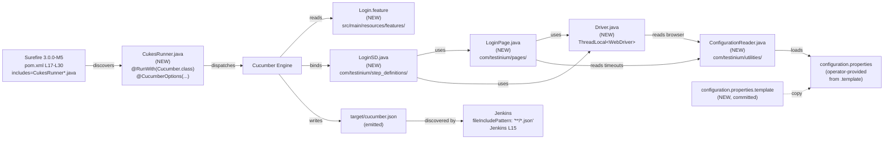
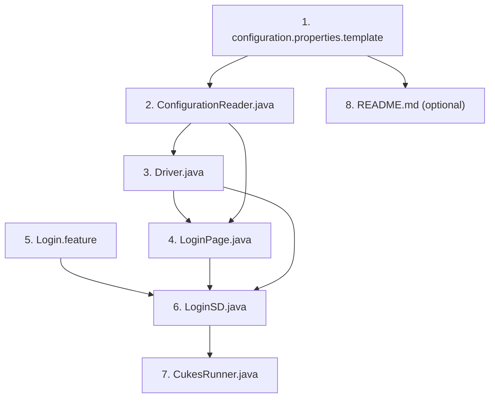
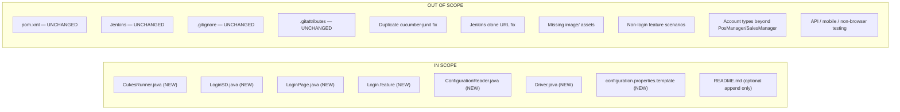

# Technical Specification

# 0. Agent Action Plan

## 0.1 Intent Clarification

This sub-section restates the user's feature request in precise technical language, surfaces implicit dependencies that are not literally written but are required for the features to operate, and translates the requirements into the execution strategy that downstream code-generation agents will follow.

### 0.1.1 Core Feature Objective

Based on the prompt, the Blitzy platform understands that the new feature requirement is to add **two strictly additive features** to the `testinium-qa` project — a Test Authoring Layer (Feature 1) and a Configuration Management System (Feature 2) — without modifying any committed build, CI, or repository-metadata file other than (optionally) `README.md` for a single setup note.

**Feature 1 — Test Authoring Layer (Login Module).** The Blitzy platform understands that this feature delivers the four Java/Gherkin source artifacts that the existing build contract already expects but does not currently contain. The Surefire plugin is configured to discover runner classes matching `**/CukesRunner*.java` [pom.xml:L26-L28], the documented `@CucumberOptions` in [README.md:L77-L88] reference `features = "src/main/resources/features"` and `glue = "com/testinium/step_definitions"`, and the README's sample Gherkin scenarios carry the Jira-aligned tags `@UPGN-286`, `@UPGN-287`, and `@UPGN-288` [README.md:L115,L123,L131]. The four artifacts to be added are:

- `CukesRunner.java` — a JUnit-driven runner class annotated with `@RunWith(Cucumber.class)` and `@CucumberOptions(...)` that satisfies the Surefire discovery pattern and produces the four report outputs (HTML, JSON, rerun.txt, PrettyReports) at the documented `target/` paths.
- `LoginSD.java` — Cucumber step-definition class implementing the Given/When/Then steps that match every Gherkin step in `Login.feature`, located under the documented glue path.
- `LoginPage.java` — Page Object Model class encapsulating the locators and actions for the Testinium login page, consumed by `LoginSD.java`.
- `Login.feature` — Gherkin feature file containing the three scenario tags (`@UPGN-286`, `@UPGN-287`, `@UPGN-288`) with the example data tables for `PosManager` (two rows) and `SalesManager` (three rows) and the French-locale empty-field validation message <cite index="22-2">"Veuillez renseigner ce champ."</cite> exactly as documented in [README.md:L137-L148].

**Feature 2 — Configuration Management System.** The Blitzy platform understands that this feature introduces a centralized externalized-configuration mechanism that Feature 1 will consume and that closes the Critical Success Factor identified in the System Overview — namely that `configuration.properties` is `.gitignore`-excluded [.gitignore:L3] and is not committed, leaving new contributors without any documented way to bootstrap the file. The three artifacts to be added are:

- `configuration.properties.template` — a committed template file at the project root that documents the four expected keys (`browser`, `base_url`, `implicit_wait`, `explicit_wait`) with placeholder values, so a new contributor can run `cp configuration.properties.template configuration.properties` to bootstrap a runnable local configuration.
- `ConfigurationReader.java` — a utility class that reads `configuration.properties` into an in-memory `Properties` instance at class load time and exposes a `get(String key)` accessor that returns the **system property** value when one is set (so `-Dbrowser=firefox` overrides the file) and falls back to the file value otherwise. It fails fast with a descriptive error message if neither source provides the requested key or if the file is absent at runtime.
- `Driver.java` — a singleton WebDriver factory built on `ThreadLocal<WebDriver>` so that under Surefire's `<parallel>methods</parallel>` configuration [pom.xml:L22] each test method receives its own browser session. Driver binary provisioning is delegated to the already-declared `webdrivermanager:5.1.0` artifact [pom.xml:L42-L46], with the browser type (`chrome`, `firefox`, `edge`) selected via `ConfigurationReader.get("browser")`.

**Implicit Requirements (Detected and Surfaced).** The Blitzy platform has identified the following requirements that are not literally written in the user prompt but are implied by the existing system, the dependency stack, and the user's explicit edge-case list:

- **Thread-safe driver scoping.** Because Surefire is configured with `<parallel>methods</parallel>` and `<useUnlimitedThreads>true</useUnlimitedThreads>` [pom.xml:L22-L23], a single static `WebDriver` field would race across concurrent scenario methods. `Driver.java` must hold its driver in a `ThreadLocal<WebDriver>` to deliver one session per thread and must expose a `quitDriver()` method that calls both `WebDriver.quit()` and `ThreadLocal.remove()`.
- **Explicit waits, no `Thread.sleep`.** The user prompt explicitly flags "Login page element load timing — `LoginPage.java` should use explicit waits (configurable timeout from `ConfigurationReader`) rather than hardcoded `Thread.sleep`." This implies a `WebDriverWait` instance whose timeout is sourced from `ConfigurationReader.get("explicit_wait")`.
- **Fail-fast configuration semantics.** The user prompt states "Missing `configuration.properties` file — `ConfigurationReader` should fail fast with a descriptive message listing required properties." This implies the loader must catch `FileNotFoundException` and re-throw a `RuntimeException` whose message enumerates the four expected keys.
- **System property precedence.** The user prompt states "`-Dbrowser=firefox` must take priority over the value in `configuration.properties`." This implies the accessor checks `System.getProperty(key)` first and only consults the loaded `Properties` instance as a fallback.
- **Contract-exact `@CucumberOptions`.** The four report-plugin paths in [README.md:L78-L83] are not advisory — the Jenkins pipeline aggregates results via <cite index="20-13">cucumber failedFeaturesNumber: -1, failedScenariosNumber: -1, failedStepsNumber: -1, fileIncludePattern: '**/*.json', pendingStepsNumber: -1, skippedStepsNumber: -1, sortingMethod: 'ALPHABETICAL', undefinedStepsNumber: -1</cite> [Jenkins:L15], which scans for JSON output across the workspace. The runner's `json:target/cucumber.json` plugin entry is the upstream half of this contract and must be preserved verbatim.
- **Tag value preservation.** The Gherkin tags `@UPGN-286`, `@UPGN-287`, `@UPGN-288` provide Jira traceability (Feature F-016 in the catalogued feature inventory). The user prompt explicitly requires these literal tag strings on the corresponding scenarios in `Login.feature`.

### 0.1.2 Special Instructions and Constraints

The user prompt contains several non-negotiable directives that the Blitzy platform must respect verbatim:

**CRITICAL — Minimal Change Clause.** The user states, quoted exactly: *"Make only the changes that are absolutely necessary to implement these two features. Do not refactor, optimize, or modify existing code unless it is directly required for the new features to work. Your goal is to add functionality with minimal disruption to the existing system."* This is a binding scope constraint, not a stylistic preference. All work is delivered as **new files only**, with the single allowed exception of `README.md` (and only for a setup note about the configuration template).

**Files that MUST remain unmodified:**

- `pom.xml` — all dependencies, plugin configuration, and Maven coordinates [pom.xml:L1-L82] must remain exactly as committed. Specifically, the duplicate `io.cucumber:cucumber-junit` declarations at versions `7.2.3` [pom.xml:L60-L65] and `7.3.4` [pom.xml:L76-L80] are known anomalies but are explicitly out of scope to fix.
- `Jenkins` — the three-stage pipeline definition [Jenkins:L1-L17] must not be modified, including the clone URL `https://github.com/BalamiRR/Upgenix-QA.git` [Jenkins:L3] which is a known repository-name divergence but is explicitly out of scope to fix.
- `.gitignore` — the `configuration.properties` exclusion [.gitignore:L3] must remain in place; the resolution path is the committed `configuration.properties.template`, not the removal of the exclusion.
- `.gitattributes` — the linguist override `*.html linguist-detectable=false` [.gitattributes:L1] must remain unchanged.

**Architectural Requirements (verbatim from the user prompt):**

- *"All new code goes into new files only — do not modify pom.xml, Jenkins, .gitattributes, or .gitignore"*
- *"Isolate all new code under src/main/java/com/testinium/ and src/main/resources/features/"*
- *"The CukesRunner.java class MUST match the Surefire include pattern **/CukesRunner*.java"*
- *"The @CucumberOptions MUST use the exact paths documented in README (features, glue, plugin)"*
- *"The Login.feature MUST use tags @UPGN-286, @UPGN-287, @UPGN-288 as documented"*
- *"If you identify issues in existing code, note them in code comments but do not fix unless required for the feature"*
- *"When multiple implementation approaches exist, choose the one that requires the least modification to existing code"*

**User Examples (preserved verbatim from the user prompt's example data tables, sourced from README):**

User Example — SalesManager rows: `salesmanager7@info.com / salesmanager`, `salesmanager8@info.com / salesmanager`, `salesmanager9@info.com / salesmanager` [README.md:L139-L142].

User Example — PosManager rows: `posmanager5@info.com / posmanager`, `posmanager6@info.com / posmanager` [README.md:L146-L148].

User Example — French-locale validation string: <cite index="22-2">"Veuillez renseigner ce champ."</cite> [README.md:L135].

User Example — Documented `@CucumberOptions` block:

```java
@CucumberOptions(
    plugin = {
        "html:target/cucumber-reports.html",
        "json:target/cucumber.json",
        "rerun:target/rerun.txt",
        "me.jvt.cucumber.report.PrettyReports:target/cucumber"
    },
    features = "src/main/resources/features",
    glue = "com/testinium/step_definitions",
    dryRun = false,
    tags = "@LogOut"
)
```

Source: [README.md:L77-L88]. The implementation must adopt these `plugin`, `features`, and `glue` values verbatim; the `tags` value will be set to a literal that selects the three login scenarios (e.g., `"@UPGN-286 or @UPGN-287 or @UPGN-288"`) since the documented `@LogOut` tag is illustrative only.

**"Note-But-Do-Not-Fix" Discipline.** The user enumerates three known anomalies that must be acknowledged but explicitly not repaired:

- *"Do not fix the duplicate cucumber-junit dependency (7.2.3 vs 7.3.4) — note it but leave it."*
- *"Do not fix the Jenkins clone URL divergence — note it but leave it."*
- *"Do not add the missing image/ assets — note their absence but leave it."*

Where these anomalies are encountered during implementation, a single-line code comment may reference them; no remediation is permitted.

**Web Search Requirements.** None. The user prompt is self-contained: every required version, file path, tag value, glue path, and example row is specified by the user or grounded in the existing repository contents. No external research is needed because the implementation conforms to (a) the already-declared dependency versions in `pom.xml` [pom.xml:L34-L80], (b) the documented contracts in `README.md`, and (c) the configuration policy in `.gitignore`.

### 0.1.3 Technical Interpretation

These feature requirements translate to the following technical implementation strategy:

- **To deliver Feature 1's runner class**, we will create `src/main/java/com/testinium/runners/CukesRunner.java` containing a public class `CukesRunner` annotated with `@RunWith(io.cucumber.junit.Cucumber.class)` and `@io.cucumber.junit.CucumberOptions(...)`. The `plugin` array will replicate verbatim the four entries from [README.md:L78-L83]; `features` will be the literal `"src/main/resources/features"`; `glue` will be the literal `"com/testinium/step_definitions"`; `dryRun` will be `false`; and `tags` will be a disjunction expression selecting the three login scenarios. The class body remains empty (Cucumber drives execution through annotations).

- **To deliver Feature 1's step definitions**, we will create `src/main/java/com/testinium/step_definitions/LoginSD.java` with one `@io.cucumber.java.en.Given`, three `@When`, and three `@Then` methods (or appropriately reused signatures matching the Gherkin step grammar). Each method body will delegate to `LoginPage` instance methods and read configuration values via `ConfigurationReader.get(...)`. The `WebDriver` instance is obtained via `Driver.getDriver()` so that thread-locality is preserved.

- **To deliver Feature 1's page object**, we will create `src/main/java/com/testinium/pages/LoginPage.java` whose constructor calls `PageFactory.initElements(Driver.getDriver(), this)` and whose fields are `@FindBy`-annotated `WebElement` references for the username input, password input, login button, error message, and empty-field validation message. Action methods (`enterUsername(String)`, `enterPassword(String)`, `clickLogin()`, `getErrorMessage()`, `getEmptyFieldValidation()`) wrap each interaction with a `WebDriverWait` whose duration is sourced from `ConfigurationReader.get("explicit_wait")`.

- **To deliver Feature 1's Gherkin feature**, we will create `src/main/resources/features/Login.feature` containing a `Feature:` declaration, a `Background:` matching [README.md:L111-L112], and three `Scenario Outline:` blocks tagged exactly `@UPGN-286`, `@UPGN-287`, and `@UPGN-288`, each with its corresponding step sequence and the `Examples:` blocks reproducing the PosManager and SalesManager rows. The empty-field outline uses the literal expected message <cite index="22-2">"Veuillez renseigner ce champ."</cite>.

- **To deliver Feature 2's configuration reader**, we will create `src/main/java/com/testinium/utilities/ConfigurationReader.java` containing a static `Properties` field initialized in a `static` block that opens `configuration.properties` via `FileInputStream`, calls `properties.load(fis)`, and rethrows any `IOException` as a `RuntimeException` with a message enumerating the four required keys. A public static `get(String key)` method returns `System.getProperty(key)` if non-null, else `properties.getProperty(key)`.

- **To deliver Feature 2's driver factory**, we will create `src/main/java/com/testinium/utilities/Driver.java` containing a private constructor, a private `static final ThreadLocal<WebDriver> driverPool = new ThreadLocal<>()`, a public static `getDriver()` method that lazily provisions a driver based on `ConfigurationReader.get("browser")` (`chrome`, `firefox`, `edge`) using `WebDriverManager.<browser>driver().setup()` followed by the corresponding `new ChromeDriver()` / `new FirefoxDriver()` / `new EdgeDriver()` instantiation, and a public static `quitDriver()` method that calls `driverPool.get().quit()` and `driverPool.remove()`.

- **To deliver Feature 2's configuration template**, we will create `./configuration.properties.template` at the project root with four documented properties — `browser=chrome` (default), `base_url=https://app.testinium.com` (per the user-provided flow example), `implicit_wait=10`, `explicit_wait=15` — and an inline comment block instructing the operator to copy this file to `configuration.properties` (which is `.gitignore`-excluded [.gitignore:L3]) before running `mvn clean test`.

- **To deliver the optional README setup note**, we will optionally modify `README.md` to add a brief setup paragraph instructing operators to perform the `cp configuration.properties.template configuration.properties` step. This is the only modification permitted to an existing file by the user's discipline guidelines.

## 0.2 Repository Scope Discovery

This sub-section enumerates every file in the repository that is in scope for this change, classifies each as MODIFY or CREATE, and documents the integration contracts that every new file must satisfy.

### 0.2.1 Comprehensive File Analysis

The repository in its committed state contains only five files at the root level: `pom.xml`, `Jenkins`, `README.md`, `.gitignore`, and `.gitattributes`. There are no `src/`, `target/`, or `com/testinium/` directories present at HEAD. This was confirmed by listing the working tree and matches the System Overview's characterization of the repository as <cite index="13-2">a greenfield scaffold awaiting implementation rather than an upgrade of an existing automation codebase.</cite>

**Existing Files — Disposition Map:**

| Path | Disposition | Justification |
|------|-------------|---------------|
| `pom.xml` | UNCHANGED | Forbidden by minimal-change clause; all required dependencies already declared at [pom.xml:L34-L80] |
| `Jenkins` | UNCHANGED | Forbidden by minimal-change clause; pipeline already aggregates JSON via `**/*.json` [Jenkins:L15] |
| `README.md` | OPTIONAL MODIFY | The user permits one additive setup note about the configuration template; no other edits |
| `.gitignore` | UNCHANGED | Forbidden by minimal-change clause; `configuration.properties` exclusion [.gitignore:L3] is preserved by design |
| `.gitattributes` | UNCHANGED | Forbidden by minimal-change clause; linguist override [.gitattributes:L1] is unrelated to the features |

**Integration Point Discovery.** The new files must satisfy these existing contracts without modifying them:

- **Surefire runner discovery contract.** The plugin block at [pom.xml:L17-L30] configures `maven-surefire-plugin:3.0.0-M5` with `<includes><include>**/CukesRunner*.java</include></includes>`. Any new runner whose class name does not begin with `CukesRunner` will be silently skipped. The new `CukesRunner.java` satisfies this by exact name match.
- **Cucumber plugin output contract.** The documented `@CucumberOptions(plugin = {...})` block at [README.md:L78-L83] enumerates four output destinations: `html:target/cucumber-reports.html`, `json:target/cucumber.json`, `rerun:target/rerun.txt`, and `me.jvt.cucumber.report.PrettyReports:target/cucumber`. Three of these are standard Cucumber plugins; the fourth is provided by the already-declared `me.jvt.cucumber:reporting-plugin:7.2.0` [pom.xml:L66-L70]. The new runner must replicate this block verbatim.
- **Cucumber features path contract.** [README.md:L84] documents `features = "src/main/resources/features"`. The new `Login.feature` file must live at exactly `src/main/resources/features/Login.feature`.
- **Cucumber glue path contract.** [README.md:L85] documents `glue = "com/testinium/step_definitions"`. The new `LoginSD.java` file must live under exactly `src/main/java/com/testinium/step_definitions/`.
- **Jenkins report aggregation contract.** [Jenkins:L15] uses `fileIncludePattern: '**/*.json'`, which discovers any JSON files produced into the workspace; the standard `target/cucumber.json` output from the runner satisfies this without any pipeline change.
- **Git-ignored configuration contract.** [.gitignore:L3] excludes `configuration.properties`. The committed `configuration.properties.template` file is the bootstrap mechanism — the operator copies it to `configuration.properties` (which is then git-ignored).
- **HTML linguist override contract.** [.gitattributes:L1] suppresses `*.html` files from GitHub language statistics. The runner's HTML output at `target/cucumber-reports.html` is consistent with this policy.

There are no API endpoints, database models, services, controllers, or middleware in the repository to integrate with — the project is a JVM-based test harness, not an application server. All "integration points" are file-naming, classpath, and CI-aggregation contracts as enumerated above.

### 0.2.2 Web Search Research Conducted

No web research was conducted or required. The user prompt is self-contained and supplies, or pins to existing repository contents, every concrete value needed:

- All dependency versions are taken verbatim from [pom.xml:L34-L80] (Selenium 3.141.59, WebDriverManager 5.1.0, Cucumber Java 7.2.3, Cucumber JUnit 7.2.3, JUnit 4.13.2, JavaFaker 1.0.2, Reporting Plugin 7.2.0).
- The `@CucumberOptions` plugin/features/glue values are taken verbatim from [README.md:L77-L88].
- Tag values (`@UPGN-286`, `@UPGN-287`, `@UPGN-288`) are taken verbatim from [README.md:L115,L123,L131].
- Example data tables for PosManager and SalesManager are taken verbatim from [README.md:L139-L148].
- The French-locale validation string <cite index="22-2">"Veuillez renseigner ce champ."</cite> is taken verbatim from [README.md:L135].
- ThreadLocal-based driver scoping is dictated by the Surefire `<parallel>methods</parallel>` configuration at [pom.xml:L22].
- System property override semantics and explicit-wait usage are dictated by the user's edge-case enumeration.

If a downstream code-generation agent needs to confirm Cucumber 7.x annotation packages (`io.cucumber.java.en.Given`, `io.cucumber.junit.Cucumber`, `io.cucumber.junit.CucumberOptions`) or WebDriverManager 5.x API entry points (`WebDriverManager.chromedriver().setup()`), those are already established by the `cucumber-java:7.2.3`, `cucumber-junit:7.2.3`, and `webdrivermanager:5.1.0` artifacts on the classpath — no version selection is required.

### 0.2.3 New File Requirements

The following seven new files MUST be created. Every path is absolute relative to the repository root.

**New source files (Feature 1 — Test Authoring Layer):**

| Path | Purpose |
|------|---------|
| `src/main/java/com/testinium/runners/CukesRunner.java` | JUnit-driven Cucumber runner satisfying Surefire `**/CukesRunner*.java` discovery; declares `@RunWith(Cucumber.class)` and `@CucumberOptions` matching the documented plugin/features/glue values |
| `src/main/java/com/testinium/step_definitions/LoginSD.java` | Cucumber step-definition class implementing Given/When/Then bindings for every step in `Login.feature`; consumes `LoginPage` and `ConfigurationReader` |
| `src/main/java/com/testinium/pages/LoginPage.java` | Page Object Model encapsulating login page locators and actions with explicit waits driven by `ConfigurationReader` |
| `src/main/resources/features/Login.feature` | Gherkin feature file with three scenario tags (`@UPGN-286`, `@UPGN-287`, `@UPGN-288`), background, three Scenario Outlines, and PosManager/SalesManager Examples blocks |

**New source files (Feature 2 — Configuration Management):**

| Path | Purpose |
|------|---------|
| `src/main/java/com/testinium/utilities/ConfigurationReader.java` | Loads `configuration.properties` at class load; exposes `get(String)` with `System.getProperty(...)` precedence and file fallback; fails fast with descriptive message |
| `src/main/java/com/testinium/utilities/Driver.java` | ThreadLocal singleton WebDriver factory dispatching on `ConfigurationReader.get("browser")`; uses `WebDriverManager` for driver provisioning; provides `getDriver()` and `quitDriver()` |
| `configuration.properties.template` | Project-root template documenting the four expected keys with placeholder defaults; copy-target for operator bootstrap |

**No new test files** are introduced as separate Java classes. The user prompt explicitly defines the testing framework as Cucumber + JUnit and identifies `Login.feature` and `LoginSD.java` as the test artifacts; no `@Test`-annotated classes are required. The Surefire plugin discovers the runner, and the runner dispatches to the Gherkin scenarios — that is the entire test surface for this delivery.

**No new configuration files beyond the template.** The user explicitly forbids changes to `pom.xml`, `.gitignore`, `.gitattributes`, and `Jenkins`. No `application.yaml`, `feature_settings.yaml`, or `.env.example` is part of this delivery — the four `configuration.properties` keys are the entire configuration surface.

**Folder creation implied (created implicitly by file creation):**

- `src/`
- `src/main/`
- `src/main/java/`
- `src/main/java/com/`
- `src/main/java/com/testinium/`
- `src/main/java/com/testinium/runners/`
- `src/main/java/com/testinium/step_definitions/`
- `src/main/java/com/testinium/pages/`
- `src/main/java/com/testinium/utilities/`
- `src/main/resources/`
- `src/main/resources/features/`

These are not files but directory ancestors that come into existence when their first child file is created. They require no separate creation step.

### 0.2.4 Files Confirmed Out of Scope for Modification

The following committed files are confirmed to require no changes and must remain bit-for-bit identical to the current HEAD:

- `pom.xml` — all 82 lines must remain as-is; no dependency addition, removal, or version change.
- `Jenkins` — all 17 lines must remain as-is; the clone URL anomaly is acknowledged but not corrected.
- `.gitignore` — all 24 lines must remain as-is; the `configuration.properties` exclusion is preserved by design.
- `.gitattributes` — the single linguist directive must remain as-is.

`README.md` is the sole existing file that may be modified, and only to append a brief setup note about the configuration template. If the optional README note is omitted, the README also remains bit-for-bit unchanged.

## 0.3 Dependency Analysis

This sub-section documents the dependency posture of the feature delivery. No dependency changes are introduced.

### 0.3.1 Dependency Change Summary

**No additions, no updates, no removals.** Every artifact required by the two new features is already declared in `pom.xml` [pom.xml:L34-L80]. The minimal-change clause from the user prompt explicitly forbids any modification to `pom.xml`, and no functionality in this delivery requires an artifact that the existing build does not already resolve from Maven Central.

### 0.3.2 Existing Dependencies Consumed by the New Code

The new files consume the following already-declared artifacts. No version pinning, scope change, or transitive override is performed.

| Artifact | Version | pom.xml Location | Consumer in this Delivery | Specific API Surface Used |
|----------|---------|------------------|---------------------------|---------------------------|
| `org.seleniumhq.selenium:selenium-java` | 3.141.59 | [pom.xml:L36-L40] | `Driver.java`, `LoginPage.java`, `LoginSD.java` | `WebDriver`, `WebElement`, `By`, `PageFactory`, `@FindBy`, `WebDriverWait`, `ExpectedConditions`, `ChromeDriver`, `FirefoxDriver`, `EdgeDriver` |
| `io.github.bonigarcia:webdrivermanager` | 5.1.0 | [pom.xml:L42-L46] | `Driver.java` | `WebDriverManager.chromedriver().setup()`, `.firefoxdriver().setup()`, `.edgedriver().setup()` |
| `com.github.javafaker:javafaker` | 1.0.2 | [pom.xml:L48-L52] | (Available; not required for the three login scenarios but on classpath if downstream synthetic data is desired) | `Faker` (optional) |
| `io.cucumber:cucumber-java` | 7.2.3 | [pom.xml:L54-L58] | `LoginSD.java` | `io.cucumber.java.en.Given`, `io.cucumber.java.en.When`, `io.cucumber.java.en.Then`, `io.cucumber.java.en.And` |
| `io.cucumber:cucumber-junit` | 7.2.3 (test scope) | [pom.xml:L60-L65] | `CukesRunner.java` | `io.cucumber.junit.Cucumber`, `io.cucumber.junit.CucumberOptions` |
| `me.jvt.cucumber:reporting-plugin` | 7.2.0 | [pom.xml:L66-L70] | `CukesRunner.java` (referenced via plugin string `me.jvt.cucumber.report.PrettyReports:target/cucumber`) | Plugin SPI invocation only — no Java import |
| `junit:junit` | 4.13.2 | [pom.xml:L71-L75] | `CukesRunner.java` | `org.junit.runner.RunWith` |

A second `io.cucumber:cucumber-junit` artifact at version `7.3.4` is also declared at [pom.xml:L76-L80]. This duplicate is acknowledged as a known anomaly in the System Overview but, per the user's explicit instruction *"Do not fix the duplicate cucumber-junit dependency (7.2.3 vs 7.3.4) — note it but leave it"*, the implementation does not address it. The new `CukesRunner.java` consumes only the standard `io.cucumber.junit.Cucumber` and `io.cucumber.junit.CucumberOptions` types, whose API surface is identical between 7.2.3 and 7.3.4, so the duplicate has no functional impact on the new code.

### 0.3.3 Runtime Prerequisites (Provisioned by the Operator)

These prerequisites are operator/build-agent responsibilities and are not project dependencies that can be declared in `pom.xml`:

| Prerequisite | Required Version | Source |
|--------------|------------------|--------|
| JDK | 1.8+ (highest documented supported is Java 8 per `<maven.compiler.source>8</maven.compiler.source>` at [pom.xml:L12]) | README prerequisites [README.md:L47] |
| Apache Maven | 3.x | README prerequisites [README.md:L48]; required by Surefire 3.0.0-M5 |
| Browser binary | Chrome, Firefox, or Edge (matching `browser` key in `configuration.properties`) | README prerequisites [README.md:L53] |
| Browser driver | Auto-provisioned by `WebDriverManager:5.1.0` at runtime; manual classpath fallback per [README.md:L53] | [pom.xml:L42-L46] |
| Network egress | Outbound HTTPS to vendor driver-binary endpoints on first run | WebDriverManager runtime behavior |

### 0.3.4 Import-Level Changes

No existing `import` statements in any committed file are touched, because there are no existing Java source files in the repository to update. All imports referenced below are newly introduced inside the seven new files.

**Anticipated new imports per file (illustrative only):**

| New File | Key Imports |
|----------|-------------|
| `CukesRunner.java` | `io.cucumber.junit.Cucumber`, `io.cucumber.junit.CucumberOptions`, `org.junit.runner.RunWith` |
| `LoginSD.java` | `io.cucumber.java.en.{Given,When,Then,And}`, `com.testinium.pages.LoginPage`, `com.testinium.utilities.{ConfigurationReader,Driver}`, `org.openqa.selenium.WebDriver` |
| `LoginPage.java` | `org.openqa.selenium.{WebDriver,WebElement,By}`, `org.openqa.selenium.support.{FindBy,PageFactory}`, `org.openqa.selenium.support.ui.{WebDriverWait,ExpectedConditions}`, `com.testinium.utilities.{ConfigurationReader,Driver}`, `java.time.Duration` |
| `ConfigurationReader.java` | `java.io.{FileInputStream,IOException}`, `java.util.Properties` |
| `Driver.java` | `io.github.bonigarcia.wdm.WebDriverManager`, `org.openqa.selenium.WebDriver`, `org.openqa.selenium.chrome.ChromeDriver`, `org.openqa.selenium.firefox.FirefoxDriver`, `org.openqa.selenium.edge.EdgeDriver`, `com.testinium.utilities.ConfigurationReader` |

### 0.3.5 External Reference Updates

No external references require updating. The build manifest (`pom.xml`), CI pipeline (`Jenkins`), repository-metadata files (`.gitignore`, `.gitattributes`), and the README's existing content all remain accurate without modification. The optional README setup note, if added, is purely additive prose — no existing reference is rewritten or invalidated.

## 0.4 Integration Analysis

This sub-section enumerates the contract surfaces in the existing repository that the new files must integrate with. Because the user prohibits modification of `pom.xml`, `Jenkins`, `.gitignore`, and `.gitattributes`, all integration is achieved by file-naming, classpath, and CI-aggregation conventions — not by editing existing files.

### 0.4.1 Existing Code Touchpoints

**Direct modifications required.** None of the existing committed source/configuration files require modification. The single allowed (optional) modification is to `README.md` for a setup note about `configuration.properties.template`.

| File | Modification Mode | Change Description |
|------|-------------------|--------------------|
| `README.md` | OPTIONAL APPEND | Add a brief paragraph instructing operators to run `cp configuration.properties.template configuration.properties` and edit values before executing `mvn clean test`. This is the only edit permitted to any existing file. |

All other "touchpoints" are read-only contracts:

| Existing File | Locator | Contract Surface | New File That Satisfies It |
|---------------|---------|------------------|-----------------------------|
| `pom.xml` | [pom.xml:L26-L28] | Surefire `<includes>**/CukesRunner*.java</includes>` | `CukesRunner.java` — exact class-name match |
| `pom.xml` | [pom.xml:L22] | Surefire `<parallel>methods</parallel>` | `Driver.java` — `ThreadLocal<WebDriver>` per scenario method |
| `pom.xml` | [pom.xml:L36-L75] | Eight already-declared dependencies | All seven new files — no version pinning |
| `README.md` | [README.md:L77-L88] | Documented `@CucumberOptions` plugin/features/glue values | `CukesRunner.java` — replicates plugin/features/glue verbatim |
| `README.md` | [README.md:L115,L123,L131] | Gherkin tags `@UPGN-286`, `@UPGN-287`, `@UPGN-288` | `Login.feature` — exact tag values |
| `README.md` | [README.md:L137-L148] | Example data rows for SalesManager and PosManager | `Login.feature` — exact row values |
| `README.md` | [README.md:L135] | French validation message string | `Login.feature` — exact string match |
| `Jenkins` | [Jenkins:L15] | `fileIncludePattern: '**/*.json'` | `CukesRunner.java` plugin `json:target/cucumber.json` produces a matching artifact |
| `.gitignore` | [.gitignore:L3] | `configuration.properties` is excluded | `configuration.properties.template` is the committed bootstrap mechanism |

**Dependency injections.** There is no DI container in the repository (no Spring, Guice, or Dagger). The new files use static utility methods and constructor-based composition instead:

- `Driver.getDriver()` is a static accessor returning a `ThreadLocal<WebDriver>`-managed instance — no container registration is needed.
- `ConfigurationReader.get(String)` is a static accessor — no container registration is needed.
- `LoginPage` is instantiated directly inside step-definition methods (`LoginPage loginPage = new LoginPage();`) with `PageFactory.initElements(Driver.getDriver(), this)` called in its constructor.

**Database / schema updates.** None. The project has no embedded database, no migration directory, no JDBC layer, and no ORM. The system under test is an external web application (Testinium) and is exercised through the browser-automation stack only.

### 0.4.2 Build & CI Integration

The build and CI integration is achieved by satisfying the existing contracts without modifying their declarations:



### 0.4.3 Thread-Safety Boundary

The Surefire `<parallel>methods</parallel>` configuration [pom.xml:L22] means concurrent execution of Cucumber scenario methods inside a single JVM. The integration boundary between the new code and the parallel-execution engine is `Driver.java`:

- A static `ThreadLocal<WebDriver> driverPool` ensures each thread receives its own browser session, preventing race conditions on WebDriver state.
- `Driver.quitDriver()` calls `ThreadLocal.remove()` after `WebDriver.quit()` to prevent classloader memory leaks across reused executor threads.
- `LoginSD.java` invokes `Driver.quitDriver()` in an `@After` hook (Cucumber's `io.cucumber.java.After`) to release the session at scenario boundary.
- `ConfigurationReader.java` exposes only read methods over an immutable `Properties` instance, so it is implicitly thread-safe for the `get(...)` call pattern.

### 0.4.4 Report Output Integration

The new runner's `@CucumberOptions(plugin = {...})` block produces four output streams, each of which has a downstream consumer (existing or operator-facing):

| Plugin Entry | Output Path | Consumer |
|--------------|-------------|----------|
| `html:target/cucumber-reports.html` | `target/cucumber-reports.html` | Operator local-browser inspection; `*.html` is excluded from GitHub linguist by [.gitattributes:L1] if ever inadvertently committed |
| `json:target/cucumber.json` | `target/cucumber.json` | Jenkins Cucumber Reports plugin via `fileIncludePattern: '**/*.json'` at [Jenkins:L15] |
| `rerun:target/rerun.txt` | `target/rerun.txt` | Operator rerun of failed scenarios |
| `me.jvt.cucumber.report.PrettyReports:target/cucumber` | `target/cucumber/` | Operator local-browser inspection (pretty report) |

The first and last of these are produced by Cucumber's standard plugin SPI and the third-party `me.jvt.cucumber:reporting-plugin:7.2.0` respectively; both are already on the classpath via [pom.xml:L66-L70].

### 0.4.5 Configuration Integration

The `configuration.properties` file is `.gitignore`-excluded [.gitignore:L3] and therefore never committed. The new `configuration.properties.template` provides the committed analog, and the operator workflow is:

```
cp configuration.properties.template configuration.properties
# edit configuration.properties to set environment-specific values

mvn clean test
```

System property overrides are layered on top via Maven's standard `-D` mechanism, e.g., `mvn clean test -Dbrowser=firefox -Dbase_url=https://staging.testinium.com`. The `ConfigurationReader.get(String)` method implements this precedence — system property first, file value second, failure third — so the user-flow example *"A DevOps Engineer overrides configuration via system properties (-Dbrowser=firefox -Dbase_url=...) in the Jenkins pipeline without editing any file"* is satisfied without any change to `Jenkins`.

## 0.5 Technical Implementation

This sub-section provides the file-by-file execution plan. Every file listed below MUST be created or modified exactly as specified.

### 0.5.1 File-by-File Execution Plan

CRITICAL: Every file listed below in the CREATE or MODIFY mode must be produced by downstream code-generation agents. Files marked REFERENCE are read-only contracts that must not be edited.

**Group 1 — Configuration Foundation (Feature 2 utilities consumed by Feature 1):**

| Mode | Path | Implementation Description |
|------|------|----------------------------|
| CREATE | `configuration.properties.template` | Project-root template documenting the four required keys with placeholder defaults: `browser=chrome`, `base_url=https://app.testinium.com`, `implicit_wait=10`, `explicit_wait=15`. Include a leading comment block explaining (a) the file must be copied to `configuration.properties` before running tests, (b) `configuration.properties` is `.gitignore`-excluded by design, and (c) values may be overridden via `-D<key>=<value>` on the Maven command line. |
| CREATE | `src/main/java/com/testinium/utilities/ConfigurationReader.java` | Package `com.testinium.utilities`. Public final class with a private constructor. Private static `Properties properties = new Properties()` initialized in a `static {}` block that opens `new FileInputStream("configuration.properties")`, calls `properties.load(...)`, and re-throws any `IOException` as a `RuntimeException` whose message enumerates the four required keys. Public static `String get(String key)` returns `System.getProperty(key)` if non-null, else `properties.getProperty(key)`; throws a `RuntimeException` with a descriptive message if both sources are null. |
| CREATE | `src/main/java/com/testinium/utilities/Driver.java` | Package `com.testinium.utilities`. Public final class with a private constructor. Private `static final ThreadLocal<WebDriver> driverPool = new ThreadLocal<>()`. Public static `WebDriver getDriver()`: if `driverPool.get() == null`, dispatch on `ConfigurationReader.get("browser")` (lowercased): `"chrome"` → `WebDriverManager.chromedriver().setup(); driverPool.set(new ChromeDriver());`; `"firefox"` → `WebDriverManager.firefoxdriver().setup(); driverPool.set(new FirefoxDriver());`; `"edge"` → `WebDriverManager.edgedriver().setup(); driverPool.set(new EdgeDriver());`; default → `throw new RuntimeException("Unsupported browser: " + browser)`. Public static `void quitDriver()`: if `driverPool.get() != null`, call `driverPool.get().quit()` and `driverPool.remove()`. |

**Group 2 — Test Authoring Layer (Feature 1):**

| Mode | Path | Implementation Description |
|------|------|----------------------------|
| CREATE | `src/main/java/com/testinium/pages/LoginPage.java` | Package `com.testinium.pages`. Public class. Constructor calls `PageFactory.initElements(Driver.getDriver(), this)`. `@FindBy`-annotated `WebElement` fields for: username input, password input, login button, error message (for `@UPGN-287`), empty-field validation message (for `@UPGN-288`). Field locator strategies (CSS/ID/Name) are determined at implementation time by inspecting the Testinium login page; the contract is to expose the five logical elements regardless of locator strategy. Action methods: `void enterUsername(String)`, `void enterPassword(String)`, `void clickLogin()`, `String getErrorMessage()`, `String getEmptyFieldValidationMessage()`. Each method wraps its WebDriver interaction in a `WebDriverWait(Driver.getDriver(), Duration.ofSeconds(Long.parseLong(ConfigurationReader.get("explicit_wait"))))` with an appropriate `ExpectedConditions` predicate (`elementToBeClickable`, `visibilityOf`, etc.). No `Thread.sleep` calls are permitted. |
| CREATE | `src/main/java/com/testinium/step_definitions/LoginSD.java` | Package `com.testinium.step_definitions`. Public class. Private `LoginPage loginPage = new LoginPage()` instantiated lazily (in the `@Before` hook or first step method to allow `Driver.getDriver()` resolution). Step methods bound by Cucumber 7.2.3 annotations (`io.cucumber.java.en.Given`, `When`, `Then`, `And`): one `@Given` matching `^User is on the Testinium login page$` (navigates to `ConfigurationReader.get("base_url")`); one `@When` for `^User enters "([^"]*)" username$`; one `@When` for `^User enters "([^"]*)" password$`; one `@When` for `^User clicks the login button$`; one `@Then` for `^User should see the dashboard$` (positive case for `@UPGN-286`); one `@Then` for `^User sees error message$` (negative case for `@UPGN-287`); one `@Then` for `^User sees "([^"]*)" message$` (empty-field case for `@UPGN-288`). An `@After` hook calls `Driver.quitDriver()`. |
| CREATE | `src/main/java/com/testinium/runners/CukesRunner.java` | Package `com.testinium.runners`. Public class `CukesRunner` (exact name to match Surefire `**/CukesRunner*.java`). Annotated with `@RunWith(io.cucumber.junit.Cucumber.class)` and `@io.cucumber.junit.CucumberOptions(plugin = { "html:target/cucumber-reports.html", "json:target/cucumber.json", "rerun:target/rerun.txt", "me.jvt.cucumber.report.PrettyReports:target/cucumber" }, features = "src/main/resources/features", glue = "com/testinium/step_definitions", dryRun = false, tags = "@UPGN-286 or @UPGN-287 or @UPGN-288")`. Empty class body. |
| CREATE | `src/main/resources/features/Login.feature` | Gherkin feature file. Feature line: `Feature: Testinium app login feature`. Background: `Given User is on the Testinium login page` (per [README.md:L111-L112]). Three Scenario Outlines exactly tagged `@UPGN-286`, `@UPGN-287`, `@UPGN-288`. The `@UPGN-286` and `@UPGN-287` outlines use `<username>` and `<password>` placeholders. The `@UPGN-288` outline uses the documented [README.md:L132-L135] empty-field pattern. Two `Examples:` blocks at the end: a `@SalesManager`-tagged block with three rows (`salesmanager7-9@info.com / salesmanager`) and a `@PosManager`-tagged block with two rows (`posmanager5-6@info.com / posmanager`) — exactly matching [README.md:L137-L148]. |

**Group 3 — Documentation (Optional):**

| Mode | Path | Implementation Description |
|------|------|----------------------------|
| MODIFY (optional) | `README.md` | Append a single paragraph (under an appropriate setup heading) instructing the operator: "Before running `mvn clean test` for the first time, copy `configuration.properties.template` to `configuration.properties` and set values for `browser`, `base_url`, `implicit_wait`, and `explicit_wait` appropriate to your environment. This file is intentionally `.gitignore`-excluded so that environment-specific values are never committed." No existing content in `README.md` is rewritten. |

**Files Referenced (Read-Only — MUST NOT Modify):**

| Mode | Path | Reason |
|------|------|--------|
| REFERENCE | `pom.xml` | Defines dependency versions and Surefire contract; minimal-change clause forbids edits |
| REFERENCE | `Jenkins` | Pipeline definition; minimal-change clause forbids edits |
| REFERENCE | `.gitignore` | `configuration.properties` exclusion is preserved by design |
| REFERENCE | `.gitattributes` | Linguist override is unrelated to features and must remain unchanged |

### 0.5.2 Implementation Approach per File

**Implementation order recommendation.** The files have an internal dependency graph; downstream code-generation should implement them in the following order to keep each step independently compilable:



**Per-file approach:**

- **`configuration.properties.template`** — Establish the configuration vocabulary first so subsequent files have a stable contract. The four keys (`browser`, `base_url`, `implicit_wait`, `explicit_wait`) are the entire surface; no extension keys are permitted in this delivery without further requirement.

- **`ConfigurationReader.java`** — Establish the read accessor with system-property precedence before any consumer is written. The fail-fast initialization is essential so that a missing `configuration.properties` produces a clear error during class load rather than a `NullPointerException` later.

- **`Driver.java`** — Establish the thread-scoped WebDriver factory before any code that touches the browser. The `ThreadLocal` and the `quitDriver()` lifecycle pairing are non-negotiable for correctness under Surefire `<parallel>methods</parallel>`.

- **`LoginPage.java`** — Implement the Page Object Model after `Driver` and `ConfigurationReader` exist, since the constructor depends on `Driver.getDriver()` and action methods depend on `ConfigurationReader.get("explicit_wait")`. Use `WebDriverWait` exclusively; do not use `Thread.sleep`.

- **`Login.feature`** — Compose the Gherkin file independently of any Java code. The text is mostly mechanical translation from the documented sample at [README.md:L103-L149] with the addition of a proper `Feature:` heading and the literal verification message <cite index="22-2">"Veuillez renseigner ce champ."</cite> for `@UPGN-288`.

- **`LoginSD.java`** — Implement step bindings only after `LoginPage` and `Login.feature` are stable. Every Gherkin step in the feature file must have exactly one matching `@Given`/`@When`/`@Then` method; unmatched steps will produce Cucumber "Undefined" outcomes that the Jenkins report aggregator will surface.

- **`CukesRunner.java`** — Implement last because it has no logic — it is purely declarative. The `tags` value must be a disjunction across the three Jira tags so that all three scenarios execute when Surefire invokes the runner.

- **`README.md` (optional)** — If included, append the setup note as the last change so it does not collide with any of the other file creations.

### 0.5.3 Code Pattern Sketches

The following sketches are illustrative; downstream code-generation must produce complete, compilable Java consistent with the patterns below.

`ConfigurationReader.java` accessor pattern:

```java
String value = System.getProperty(key);
return (value != null) ? value : properties.getProperty(key);
```

`Driver.java` thread-locality pattern:

```java
if (driverPool.get() == null) { /* setup + new <Browser>Driver() */ }
return driverPool.get();
```

`LoginPage.java` explicit-wait pattern:

```java
long timeout = Long.parseLong(ConfigurationReader.get("explicit_wait"));
new WebDriverWait(Driver.getDriver(), Duration.ofSeconds(timeout))
    .until(ExpectedConditions.elementToBeClickable(loginButton));
```

`CukesRunner.java` annotations pattern:

```java
@RunWith(Cucumber.class)
@CucumberOptions(plugin = {...}, features = "src/main/resources/features",
    glue = "com/testinium/step_definitions", tags = "@UPGN-286 or @UPGN-287 or @UPGN-288")
public class CukesRunner { }
```

### 0.5.4 User Interface Design

Not applicable. The deliverables of this feature addition are a Java/Cucumber test harness that exercises an external web application (Testinium) through the WebDriver protocol. No in-repo user interface is created; no design system, component library, or visual asset is in scope. The browser content rendered during a test run is rendered by the system under test, not by any code in this repository.

## 0.6 Scope Boundaries

This sub-section enumerates everything that is IN scope and everything that is OUT of scope. The boundary is derived from the user prompt's explicit IN/OUT lists, the minimal-change clause, and the discipline guidelines.

### 0.6.1 Exhaustively In Scope

**All new source files (CREATE):**

- `src/main/java/com/testinium/runners/CukesRunner.java`
- `src/main/java/com/testinium/step_definitions/LoginSD.java`
- `src/main/java/com/testinium/pages/LoginPage.java`
- `src/main/java/com/testinium/utilities/ConfigurationReader.java`
- `src/main/java/com/testinium/utilities/Driver.java`
- `src/main/resources/features/Login.feature`

**Wildcard scope of source code directories created by these files:**

- `src/main/java/com/testinium/runners/**` — limited to `CukesRunner.java`
- `src/main/java/com/testinium/step_definitions/**` — limited to `LoginSD.java`
- `src/main/java/com/testinium/pages/**` — limited to `LoginPage.java`
- `src/main/java/com/testinium/utilities/**` — limited to `ConfigurationReader.java` and `Driver.java`
- `src/main/resources/features/**` — limited to `Login.feature`

**All new configuration / template files (CREATE):**

- `configuration.properties.template` at the project root

**Documentation (OPTIONAL MODIFY):**

- `README.md` — appendable setup note about the configuration template; no rewriting of existing content

**Functional in-scope (exactly per user input):**

- Login feature scenarios: valid login (`@UPGN-286`), invalid credentials (`@UPGN-287`), empty-field validation (`@UPGN-288`)
- PosManager and SalesManager role coverage (as documented in [README.md:L137-L148] example data tables)
- French-locale empty-field validation message <cite index="22-2">"Veuillez renseigner ce champ."</cite>
- Configuration for: base URL, browser type, default implicit/explicit wait timeouts
- WebDriverManager-based driver initialization (leveraging existing F-006 dependency at [pom.xml:L42-L46])

**Generated artifacts (ephemeral, produced at runtime by `mvn clean test`):**

- `target/cucumber-reports.html`
- `target/cucumber.json` (consumed by [Jenkins:L15] `fileIncludePattern: '**/*.json'`)
- `target/rerun.txt`
- `target/cucumber/` (pretty report directory)
- `target/surefire-reports/` (Surefire's native output)
- `target/test-classes/`, `target/classes/` (compiled output)

These are not committed; they are produced into the working tree on each build and removed by `mvn clean`.

### 0.6.2 Explicitly Out of Scope

The following are **explicitly excluded** from this feature delivery. The user prompt enumerates each item directly; the list below preserves that enumeration verbatim or paraphrases minimally.

**Out of scope (feature coverage):**

- Features beyond login — no dashboard, navigation, or other module tests
- The three remaining account types beyond `PosManager` and `SalesManager` (the README references five total user types; only two are exercised here)
- API testing, mobile testing, or non-browser test domains

**Out of scope (existing-code remediation — "note-but-do-not-fix" discipline):**

- Fixing the duplicate `cucumber-junit` dependency (7.2.3 at [pom.xml:L60-L65] vs 7.3.4 at [pom.xml:L76-L80])
- Fixing the Jenkins clone URL divergence (`https://github.com/BalamiRR/Upgenix-QA.git` at [Jenkins:L3] vs the README-documented `Testinium-QA.git` at [README.md:L59])
- Adding the missing `image/` directory assets referenced by [README.md:L153] and [README.md:L165]

**Out of scope (file modification):**

- Any change to `pom.xml` [pom.xml:L1-L82] — all 82 lines must remain bit-for-bit unchanged
- Any change to `Jenkins` [Jenkins:L1-L17] — all 17 lines must remain bit-for-bit unchanged
- Any change to `.gitignore` [.gitignore:L1-L24] — the `configuration.properties` exclusion must remain in place
- Any change to `.gitattributes` [.gitattributes:L1] — the linguist override must remain unchanged
- Any rewrite of existing `README.md` content; only an appended setup paragraph is permitted, and that is optional

**Out of scope (project-wide concerns not invoked by this delivery):**

- Performance optimizations beyond feature requirements (e.g., browser-pool tuning, JVM heap sizing, parallel thread caps)
- Refactoring of existing files unrelated to integration (none exists in this case; the repository has no committed source files)
- Additional features not specified by the user (e.g., logout scenarios, dashboard verifications, profile management, the `@LogOut` tag documented illustratively in [README.md:L87])
- Selenium 3.x → 4.x migration
- JUnit 4 → JUnit 5 migration
- Reconciliation of the `@UPGN-*` tag prefix with the "Testinium" project identity (noted in tech spec section 2.4.1 as a known constraint)
- Implementation of any cross-cutting concerns (logging frameworks, custom exception hierarchies, retry policies, screenshot-on-failure hooks) — none are requested
- Provisioning of CI agents, browser binaries, or network egress configuration — these are operator responsibilities
- Creation of `configuration.properties` (the non-template file) — this is operator-provided at runtime via `cp configuration.properties.template configuration.properties`

### 0.6.3 In-Scope vs Out-of-Scope at a Glance



## 0.7 Rules for Feature Addition

This sub-section consolidates every rule, convention, and constraint emphasized by the user, with each rule traced back to its origin in the user prompt or the existing repository. Downstream code-generation must obey every rule below.

### 0.7.1 Minimal-Change Discipline (PRIMARY)

The user prompt's *"Minimal Change Clause"* is the governing principle for this delivery, and the user has emphasized it twice in the prompt. The applicable rules:

- All new code goes into new files only.
- Do not modify `pom.xml`, `Jenkins`, `.gitattributes`, or `.gitignore` — not even to fix known issues.
- Do not refactor, optimize, or reformat existing files (other than the single optional `README.md` setup-note append).
- When multiple implementation approaches exist, choose the one that requires the least modification to existing code.
- If issues are identified in existing code, note them in code comments inside new files (not by editing the existing file) but do not repair them unless required for the feature.

### 0.7.2 File-Location Boundaries

The user explicitly bounds where new files may live:

- Page objects, utilities, runner, and step definitions: `src/main/java/com/testinium/...`
- Gherkin feature files: `src/main/resources/features/`
- Configuration template: project root (`./configuration.properties.template`)

No source file may be placed outside these locations. No `src/test/java/` directory is created — the project's test surface lives in `src/main/` per the existing Surefire include pattern at [pom.xml:L26-L28].

### 0.7.3 Contract-Preservation Rules

These rules trace directly to existing contracts in the repository. Each MUST be obeyed by the new files:

- **Surefire runner discovery:** The new runner class MUST be named `CukesRunner` to match `<include>**/CukesRunner*.java</include>` at [pom.xml:L27]. The user states: *"The CukesRunner.java class MUST match the Surefire include pattern **/CukesRunner*.java."*
- **`@CucumberOptions` exactness:** The user states: *"The @CucumberOptions MUST use the exact paths documented in README (features, glue, plugin)."* This means the new runner's annotation MUST replicate verbatim:
    - `plugin = { "html:target/cucumber-reports.html", "json:target/cucumber.json", "rerun:target/rerun.txt", "me.jvt.cucumber.report.PrettyReports:target/cucumber" }` [README.md:L78-L83]
    - `features = "src/main/resources/features"` [README.md:L84]
    - `glue = "com/testinium/step_definitions"` [README.md:L85]
- **Report-output paths:** Per the user prompt: *"Report output paths must remain `target/cucumber.json`, `target/cucumber-reports.html`, `target/rerun.txt`, and `target/cucumber` to satisfy the Jenkins `fileIncludePattern: '**/*.json'` contract."*
- **Gherkin tag values:** The user states: *"The Login.feature MUST use tags @UPGN-286, @UPGN-287, @UPGN-288 as documented."* These three exact strings appear in [README.md:L115,L123,L131] and must be reproduced literally.
- **`configuration.properties` exclusion:** The committed file MUST be `configuration.properties.template`, not `configuration.properties` — the latter remains `.gitignore`-excluded at [.gitignore:L3] by design.

### 0.7.4 Implementation-Quality Rules (User-Specified Edge Cases)

The user prompt's "edge cases or boundary conditions" enumeration translates to the following hard rules:

- **Thread safety:** `Driver.java` MUST use `ThreadLocal<WebDriver>` to support Surefire's `<parallel>methods</parallel>` configuration at [pom.xml:L22] (referenced as F-003 in the feature catalog). A static `WebDriver` field is forbidden.
- **Fail-fast configuration loading:** `ConfigurationReader.java` MUST raise a `RuntimeException` with a descriptive message listing the required properties when `configuration.properties` is missing. Silent failure or null-returning fallbacks are forbidden.
- **System property precedence:** `ConfigurationReader.get(String)` MUST return `System.getProperty(key)` if present, otherwise the file value. `-Dbrowser=firefox` MUST take priority over the value in `configuration.properties`.
- **Clear browser-driver errors:** `Driver.java` MUST surface a clear error (not a NullPointerException) when driver download fails in a network-restricted environment. This means defensive handling around `WebDriverManager.<browser>driver().setup()` failures and explicit error messages.
- **No `Thread.sleep`:** `LoginPage.java` MUST use explicit waits (`WebDriverWait` with `ExpectedConditions`) whose timeout is sourced from `ConfigurationReader.get("explicit_wait")`. Hardcoded `Thread.sleep(...)` calls are forbidden anywhere in the new code.

### 0.7.5 "Note-But-Do-Not-Fix" Discipline

The user enumerates three known anomalies that must be respected but not repaired:

- **Duplicate `cucumber-junit` dependency.** Present at versions 7.2.3 [pom.xml:L60-L65] and 7.3.4 [pom.xml:L76-L80]. *"Do not fix the duplicate cucumber-junit dependency (7.2.3 vs 7.3.4) — note it but leave it."*
- **Jenkins clone URL divergence.** [Jenkins:L3] clones `https://github.com/BalamiRR/Upgenix-QA.git` rather than `Testinium-QA.git`. *"Do not fix the Jenkins clone URL divergence — note it but leave it."*
- **Missing `image/` directory.** [README.md:L153] and [README.md:L165] reference `./image/Jenkins-Cucumber-Reports.png` and `./image/Jira-Test-Exectuion.png` (also containing a misspelling of "Execution"). *"Do not add the missing `image/` assets — note their absence but leave it."*

Where the implementation must touch a class or path that exposes one of these anomalies (e.g., when authoring `CukesRunner.java` whose classpath would receive both `cucumber-junit` versions), a single-line code comment inside the **new** file may acknowledge the anomaly. No commit may modify the existing file that contains the anomaly.

### 0.7.6 Feature-Specific Conventions

- **Cucumber annotation source:** Use Cucumber 7.x English annotations from package `io.cucumber.java.en.*` (`Given`, `When`, `Then`, `And`, `But`). Do not use the legacy `cucumber.api.java.en.*` packages (those belong to Cucumber 1.x/2.x).
- **JUnit runner annotation source:** Use `org.junit.runner.RunWith` (JUnit 4) paired with `io.cucumber.junit.Cucumber` and `io.cucumber.junit.CucumberOptions`. Do not use JUnit 5 (`org.junit.jupiter.*`); the project intentionally uses the JUnit 4 / `cucumber-junit` adapter pattern (Feature F-008 in the feature catalog).
- **Page Object instantiation:** `LoginPage` MUST call `PageFactory.initElements(Driver.getDriver(), this)` in its constructor so `@FindBy`-annotated `WebElement` fields are wired before any action method is invoked.
- **Configuration key naming:** The four configuration keys MUST be exactly `browser`, `base_url`, `implicit_wait`, `explicit_wait` (lowercase, snake_case for multi-word keys). No alternative naming (`baseURL`, `browserType`, etc.) is permitted.
- **Browser name normalization:** `Driver.java` MUST treat the `browser` configuration value case-insensitively (i.e., `Chrome`, `CHROME`, and `chrome` should all dispatch to the Chrome path); recommended approach is `.toLowerCase()` before the switch/dispatch.
- **Tag expression in runner:** The `tags` value in `@CucumberOptions` MUST select the three required scenarios. Acceptable forms: `"@UPGN-286 or @UPGN-287 or @UPGN-288"` (Cucumber 5+ expression syntax). Do not use the Cucumber 4-and-earlier comma syntax (`"@UPGN-286,@UPGN-287,@UPGN-288"`), which is deprecated in Cucumber 7.x.

### 0.7.7 Performance and Scalability Considerations

- **Method-level parallelism is enabled** by [pom.xml:L22-L23] with `<parallel>methods</parallel>` and `<useUnlimitedThreads>true</useUnlimitedThreads>`. The new code must remain thread-safe (covered by the `Driver.java` `ThreadLocal` rule).
- **No additional thread limits are imposed** by this delivery. The commented-out `<threadCount>4</threadCount>` at [pom.xml:L24] remains commented out per the minimal-change clause.

### 0.7.8 Security Considerations

- **No real credentials in committed code.** The example data tables in [README.md:L139-L148] use plaintext test credentials (`salesmanager7@info.com / salesmanager`) that are reproduced verbatim in `Login.feature`. Per the security implications documented in tech spec section 2.4.4, these must reference non-production accounts only.
- **No credentials in `configuration.properties.template`.** The template MUST contain placeholders only; the user prompt's enumeration of expected keys (`browser`, `base_url`, `implicit_wait`, `explicit_wait`) deliberately excludes credentials.
- **`.gitignore` exclusion is preserved.** `configuration.properties` remains uncommitted by design; only `configuration.properties.template` is committed.

## 0.8 References

This sub-section enumerates every source consulted to ground the Agent Action Plan, every file inspected in the repository, every tech-spec section retrieved, and the metadata associated with the user's submission.

### 0.8.1 Repository Files Inspected

Every file in the repository was inspected at full length. The locator column references the line-range or key path consulted for each grounding claim.

| Path | Lines Read | Purpose / Key Findings |
|------|------------|------------------------|
| `pom.xml` | L1-L82 (full) | Confirmed Maven coordinates `org.example:testinium-qa:1.0-SNAPSHOT` [L7-L9], Java 8 source/target [L11-L14], Surefire plugin configuration with `<parallel>methods</parallel>`, `<useUnlimitedThreads>true</useUnlimitedThreads>`, `<testFailureIgnore>true</testFailureIgnore>`, and `<includes>**/CukesRunner*.java</includes>` [L17-L30], and all eight declared dependencies: `selenium-java:3.141.59` [L36-L40], `webdrivermanager:5.1.0` [L42-L46], `javafaker:1.0.2` [L48-L52], `cucumber-java:7.2.3` [L54-L58], `cucumber-junit:7.2.3` [L60-L65], `reporting-plugin:7.2.0` [L66-L70], `junit:4.13.2` [L71-L75], and `cucumber-junit:7.3.4` [L76-L80] (the documented duplicate). |
| `Jenkins` | L1-L17 (full) | Confirmed three-stage pipeline: clone of `Upgenix-QA.git` [L3], `mvn clean test` via `isUnix()` branch [L7-L11], and Cucumber report aggregation with `fileIncludePattern: '**/*.json'` and all thresholds set to `-1` [L15]. |
| `README.md` | L1-L172 (full) | Confirmed prerequisites (JDK 1.8+, Maven, IntelliJ, IntelliJ Cucumber/Maven plugins, browser driver) [L47-L53], the documented `@CucumberOptions` snippet with plugin/features/glue values [L77-L88], the sample Gherkin feature with tags `@UPGN-286` [L115], `@UPGN-287` [L123], `@UPGN-288` [L131], the French-locale validation message [L135], and the example data tables for SalesManager [L139-L142] and PosManager [L146-L148]. |
| `.gitignore` | L1-L24 (full) | Confirmed `configuration.properties` exclusion [L3] and standard Java exclusions (`*.class`, `*.log`, `*.jar`, `hs_err_pid*`, etc.). |
| `.gitattributes` | L1 (full) | Confirmed single linguist directive `*.html linguist-detectable=false`. |

The root folder was enumerated via `get_source_folder_contents` on the empty path; no subdirectories, no `src/`, no `target/`, no `image/` directory exists at HEAD.

### 0.8.2 Tech Spec Sections Retrieved

The following sections of the existing technical specification were retrieved and consulted for cross-reference and grounding:

| Section | Key Insights Used |
|---------|--------------------|
| 1.2 System Overview | Confirmed greenfield-scaffold characterization, identified inconsistencies (clone URL divergence, duplicate `cucumber-junit`, missing image assets), Critical Success Factors including the `configuration.properties` provisioning gap |
| 2.1 FEATURE CATALOG | Confirmed feature inventory (F-001 through F-016) and the "Proposed" status of F-016 (Jira Traceability via Gherkin Tags) due to the absence of feature files |
| 2.4 IMPLEMENTATION CONSIDERATIONS | Confirmed technical constraints (F-004 requires at least one `CukesRunner*.java`; F-008 has duplicate version anomaly; F-014 `configuration.properties` provisioning requirement), security implications (plaintext credentials in example tables — non-production only), and maintenance requirements |
| 3.2 FRAMEWORKS & LIBRARIES | Confirmed exact dependency versions, Surefire configuration table, and the Critical Anomaly section detailing the duplicate `cucumber-junit` resolution risk |
| 5.2 COMPONENT DETAILS | Confirmed component interaction diagrams, the documented `@CucumberOptions` plugin path table, the cross-platform CI branching, and the artifact-output paths (`target/cucumber.json`, `target/cucumber-reports.html`, `target/rerun.txt`, `target/cucumber/`) |

### 0.8.3 Inline Citation Format

This Agent Action Plan uses the inline-citation format `[<path>:<locator>]` immediately after each grounded claim about the existing system. The locator is whichever is natural for the file type:

- **Line range** for source/config files: `[pom.xml:L26-L28]`, `[README.md:L77-L88]`, `[Jenkins:L15]`
- **Single line** for atomic facts: `[.gitignore:L3]`, `[.gitattributes:L1]`

No claim in this AAP about the existing system relies on inferred knowledge; every existing-system claim is traceable to a specific path and locator. Forward-looking claims about the **new files** to be created are by definition not grounded in existing source — they are the prescriptive contract this AAP defines.

### 0.8.4 Attachments

No file attachments were provided by the user.

The user prompt mentions a folder `/tmp/environments_files` reserved for any user-supplied files, but this folder was inspected and found to be empty. No environment files, configuration files, design files, or auxiliary documents were attached.

### 0.8.5 Figma URLs and Design Assets

No Figma URLs or design assets were provided. The deliverable is a Java/Selenium test harness with no user-facing UI, so the Design System Alignment Protocol does not apply. No Figma frame analysis, no design-token catalog, and no design-system compliance mapping are part of this delivery.

### 0.8.6 Environment Variables and Secrets

The user specified zero environment variables and zero secrets to be made available to the build process. The new code's runtime configuration surface is entirely defined by `configuration.properties` (operator-provided locally) plus optional `-D<key>=<value>` system-property overrides on the Maven command line. No secret-management integration (Jenkins credentials, AWS Secrets Manager, HashiCorp Vault, etc.) is part of this delivery.

### 0.8.7 External Documentation Used (Optional Background)

No external web research was conducted. All values needed for implementation are derived from the repository itself or from the user prompt:

- Cucumber 7.x annotation packages and runner pattern: established by the existing `cucumber-java:7.2.3` and `cucumber-junit:7.2.3` artifacts at [pom.xml:L54-L65]
- WebDriverManager 5.x API: established by the existing `webdrivermanager:5.1.0` artifact at [pom.xml:L42-L46]
- Selenium 3.141.59 API (WebDriver, WebElement, By, PageFactory, FindBy, WebDriverWait, ExpectedConditions): established by the existing `selenium-java:3.141.59` artifact at [pom.xml:L36-L40]
- JUnit 4 `@RunWith` annotation: established by the existing `junit:4.13.2` artifact at [pom.xml:L71-L75]

### 0.8.8 Search Log Appendix

The following exhaustive list documents every search and retrieval performed to produce this AAP, for downstream verification:

**Repository inspections (deep search):**

1. `bash` — listed root directory contents and `find . -type f -not -path './.git/*'`; confirmed the five committed files (no `src/`, `target/`, `image/`, or `.blitzyignore`)
2. `bash` — searched for `.blitzyignore` files repository-wide; confirmed none exist
3. `get_source_folder_contents` on root path (`""`) — confirmed three first-order children listed (`pom.xml`, `.gitattributes`, `README.md`); note that `.gitignore` and `Jenkins` also exist on disk per `find` output
4. `read_file` on `pom.xml` (L1-L82) — Maven manifest
5. `read_file` on `Jenkins` (L1-L17) — declarative pipeline
6. `read_file` on `README.md` (L1-L172) — project documentation including sample runner, sample Gherkin, and example data tables
7. `read_file` on `.gitignore` (L1-L24) — VCS exclusions including `configuration.properties`
8. `read_file` on `.gitattributes` (L1) — GitHub Linguist directive

**Tech spec inspections (cross-reference):**

9. `get_tech_spec_section` for `1.2 System Overview` — system context, current limitations, identified inconsistencies, success criteria
10. `get_tech_spec_section` for `2.1 FEATURE CATALOG` — F-001 through F-016 feature inventory
11. `get_tech_spec_section` for `2.4 IMPLEMENTATION CONSIDERATIONS` — technical constraints, performance, scalability, security, maintenance
12. `get_tech_spec_section` for `3.2 FRAMEWORKS & LIBRARIES` — exact dependency versions, Surefire configuration, duplicate-`cucumber-junit` anomaly detail
13. `get_tech_spec_section` for `5.2 COMPONENT DETAILS` — component diagrams, state diagrams, sequence diagrams

**Folder-level inspections:**

The repository has no subdirectories at HEAD beyond `.git/`, so no further folder-level inspection was applicable.

**Total tool invocations (excluding planning):** 13 retrieval operations (5 file reads, 5 tech-spec section reads, 1 root folder listing, 2 bash listings/searches), well within the deep-search budget for a five-file repository.

